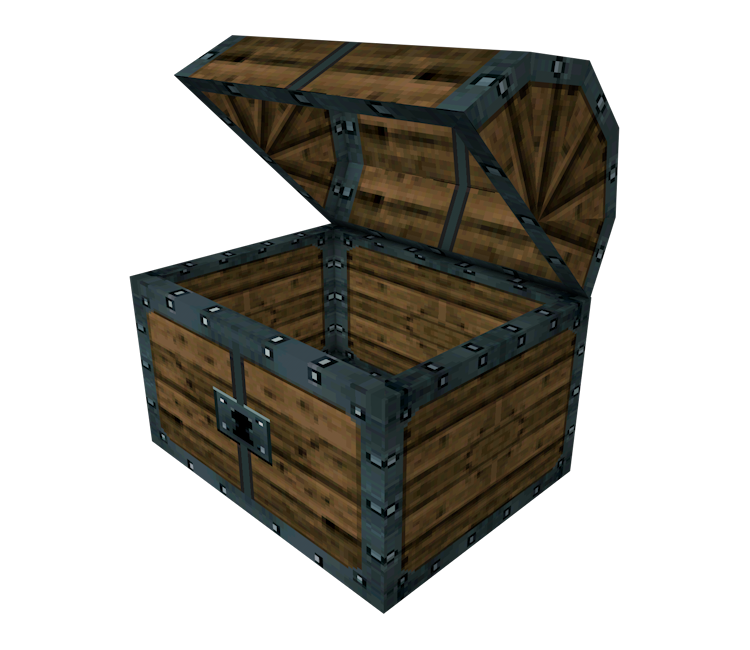

# Zelda Chest Arduino Project



This repository contains the code and documentation for a Zelda-themed chest that I created for my girlfriend. The chest uses an Arduino, RFID sensor, speakers, and a servo motor to replicate the iconic chest-opening experience from The Legend of Zelda video game series.

## Table of Contents

- [Project Overview](#project-overview)
- [Materials](#materials)
- [Circuit Diagram](#circuit-diagram)
- [Installation](#installation)
- [Usage](#usage)
- [Acknowledgments](#acknowledgments)
- [License](#license)

## Project Overview

The Zelda Chest project is a fun and creative way to surprise your loved one with a special gift or message. When the RFID key, which is designed like a Zelda Rupee, is brought close to the chest, it triggers the chest to open with the classic Zelda chest-opening sound. This project combines electronics, programming, and a touch of nostalgia to create a memorable experience.

## Materials

To create your own Zelda Chest, you will need the following materials:

- Arduino Uno or similar microcontroller
- RFID sensor module (e.g., MFRC522)
- Servo motor
- Speakers or buzzer
- Zelda Rupee-shaped RFID key
- Wooden chest or box (to house the electronics)
- Jumper wires
- Power source (e.g., battery pack or USB power supply)
- Small hinges and screws (for the chest lid)
- Soldering iron and solder (optional, for securing connections)

## RFID sensor module


Finished piece used for RFID detection, made to work with first key that is scanned.

## Installation

To set up the Zelda Chest, follow these steps:

1. Clone this repository to your local computer:

   ```
   git clone https://github.com/yourusername/zelda-chest-arduino.git
   ```

2. Upload the Arduino sketch (`zelda_chest.ino`) to your Arduino board using the Arduino IDE.

3. Wire up the components according to the circuit diagram provided.

4. Place the RFID sensor inside the chest, and secure the servo motor to the chest lid.

5. Ensure that the speakers or buzzer are positioned inside the chest and can produce the desired sound.

6. Attach the RFID key (Zelda Rupee) to your loved one's keychain.

## Usage

To use the Zelda Chest:

1. Power up the Arduino board and ensure the chest is closed.

2. Approach the RFID key (Zelda Rupee) to the chest.

3. When the RFID sensor detects the key, the chest lid will open, and the Zelda chest-opening sound will play.

4. Place your special gift or message inside the chest for your loved one to discover.

5. Enjoy the nostalgic and magical experience!

## Acknowledgments

I would like to thank the Arduino community for their valuable resources and support in creating this project. Additionally, credit goes to Nintendo for the iconic Zelda chest-opening sound.

## License

This project is open-source under the [MIT License](LICENSE). Feel free to modify and share it as you wish, and don't forget to share your Zelda Chest creations with the world!

If you have any questions or need assistance with this project, feel free to contact me at your@email.com.

Happy crafting and may your Zelda Chest bring joy and adventure to your loved one's day!
